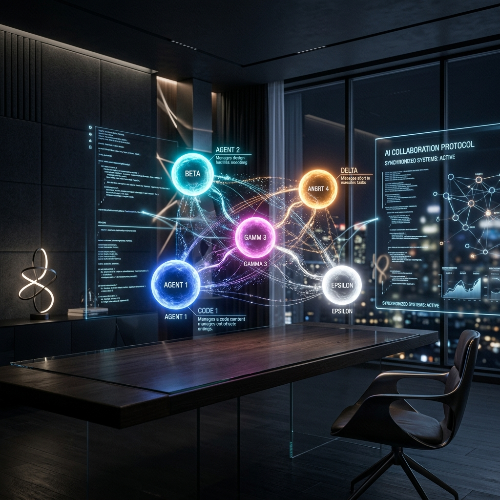
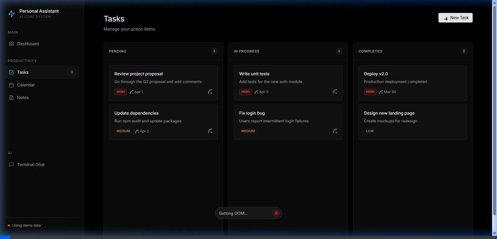
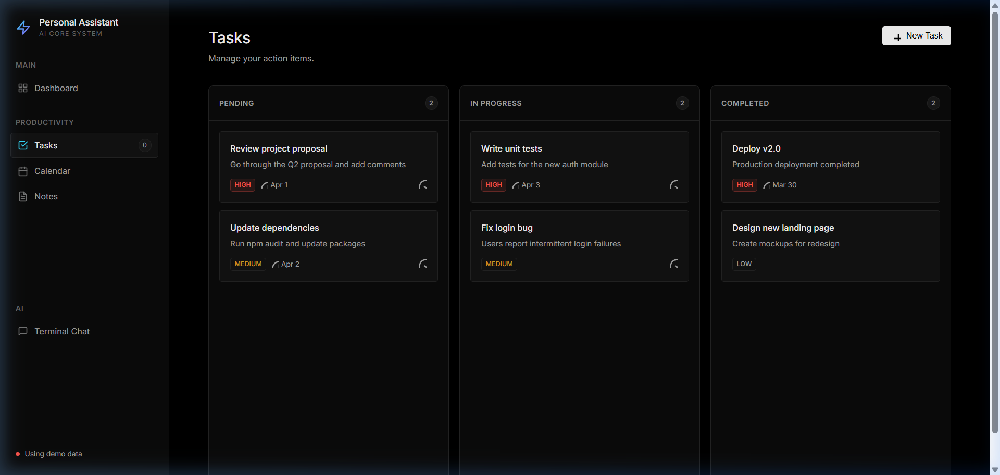
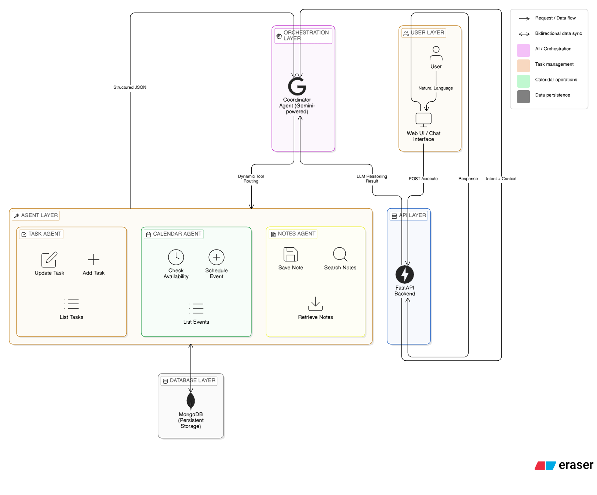

<div align="center">
  

  <h1>🚀 Multi-Agent Productivity Assistant</h1>
  <p>An intelligent, context-aware productivity hub powered by autonomous AI agents functioning seamlessly with Gemini. Schedule events, manage tasks, and generate insights automatically using natural language in a stunning, modern dashboard.</p>

  [](https://www.python.org/downloads/)
  [](https://fastapi.tiangolo.com/)
  [](https://ai.google.dev/)
  [](https://www.mongodb.com/)
  [](https://multi-agent-assistant.onrender.com)
</div>

<br/>

## ✨ Key Features

- **🧠 Autonomous Agent Architecture:** Employs the Model Context Protocol (MCP) using native Gemini tool calling to route your user requests optimally across distinct sub-agents.
- **📅 Calendar Agent:** Understands relative date requests (e.g., "Schedule a meeting for next Friday at 3 PM") and manages events dynamically.
- **✅ Task Management:** Automatically creates and coordinates your Kanban board, setting statuses, priorities, and deadlines intelligently.
- **📝 Intelligent Notes:** Indexes contextual thought chunks—capable of generating code blocks, writing technical designs, and maintaining knowledge bases.
- **💻 Minimalist "Linear" Design:** A premium, dark-mode-first SPA featuring micro-animations, bento grids, and a reactive DOM state without the heavy overhead of large frameworks.
- **🚢 Cloud-Native:** Fully Dockerized and deployed gracefully on Render with robust fallback modes.

<br/>

## 🎥 App Demonstration

Watch the Multi-Agent Productivity Assistant dynamically operate within its beautiful dark-themed environment, including the responsive sidebar and live routing.

<div align="center">
  
</div>

<br/>

## 🛠️ Technology Stack

| Component | Technology | Rationale |
|-----------|------------|-----------|
| **Backend API** | FastAPI + Uvicorn | High-performance async endpoints and automatic OpenAPI schema generation. |
| **Generative AI**| Google Gemini 1.5 Flash | Next-gen reasoning and native `FunctionDeclaration` structured JSON tool execution. |
| **Database**    | MongoDB | Flexible NoSQL schema for deeply nested AI tasks and dynamic event documents. |
| **Frontend**    | Vanilla JS + CSS3 | Ultra-lightweight reactive SPA with custom hash routing for raw speed and pure aesthetics. |
| **Deployment**  | Docker + Render | Instant horizontal scaling and consistent cross-environment builds. |

---

## 📸 Interface Preview

<div align="center">
  
  <br/>
  <em>A sleek, intuitive Kanban-powered dashboard displaying active tasks, metrics, and calendar integrations.</em>
</div>

<br/>

## 🚀 Quick Setup (Local Development)

### 1. Clone the Repository
```bash
git clone https://github.com/pratyush06-aec/Multi-Agent-Productivity-Assistant.git
cd Multi-Agent-Productivity-Assistant
```

### 2. Configure Environment Variables
Create a file named `.env` in the root folder with the following keys:
```env
GEMINI_API_KEY=your_gemini_key_here
MONGO_URI=mongodb://localhost:27017/agent_system
DATABASE_NAME=agent_system
```

### 3. Setup Virtual Environment & Dependencies
```bash
python -m venv venv
source venv/Scripts/activate # On Windows
pip install -r requirements.txt
```

### 4. Run the Uvicorn Server
```bash
python -m uvicorn api.main:app --reload --port 8000
```
Visit the running application at `http://127.0.0.1:8000`.

---

## 🐳 Running with Docker
A lean Docker image has been established for easy scaling:
```bash
docker build -t multi-agent-system .
docker run -p 8080:8080 --env-file .env multi-agent-system
```
Access at `http://localhost:8080`.

<br/>

## 🗺️ System Architecture

<div align="center">
  
</div>

1. **Coordinator Agent:** Parses the `query`, isolates the intention via Gemini 1.5 parsing, and delegates execution utilizing strict JSON schema Function Calling.
2. **Sub-Agents:** Specialized executors (Tasks, Calendar, Notes) execute validations directly translating complex human intent into database transactions.
3. **Database Layer:** The `mongo_client.py` gracefully provides robust error resistance by routing fallbacks when the database experiences timeouts.
4. **Client Sink:** Updates are instantly reflected onto the dark-shell web interface.

<br/>

<div align="center">
  <i>Developed with precision and design-driven engineering.</i>
</div>
